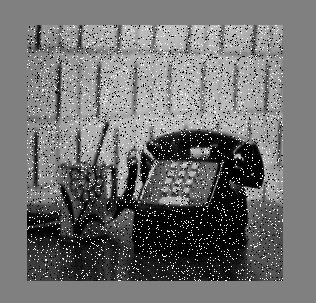
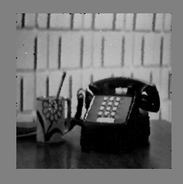

# MEDIAN-FILTER
## PROBLEM STATEMNET
### Implement a median filter from scratch using C++ .  Input should be an Image and the output should be a Linear filtered Image, Neat Documentation is expected with Code,Explanation, Input, and Output Image.

## INPUT

## OUTPUT

